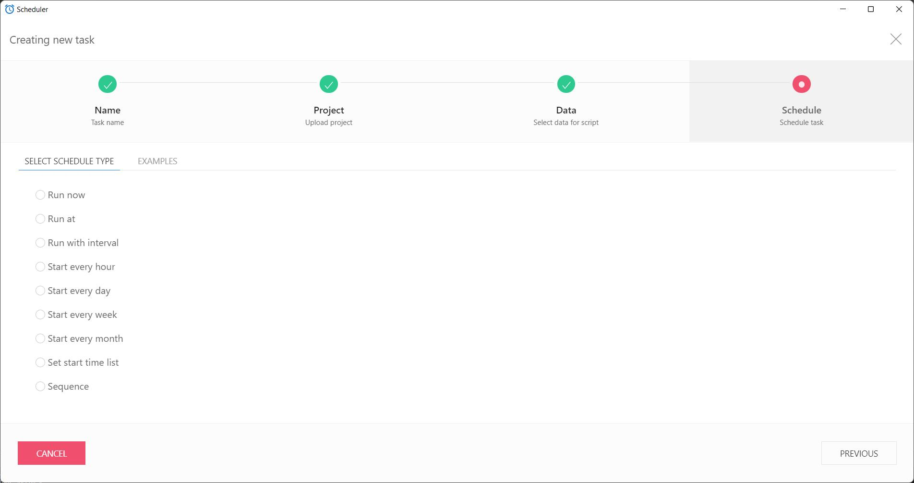

# Vodafone Speedtest

## Einleitung

Dieser Speedtest basiert auf dem [Vodafone Speedtest](https://speedtest.vodafone.de) und nutzt das [Browser Automation Studio](https://bablosoft.com/shop/BrowserAutomationStudio#download) für die Auswertung. Durch dieses Script ist es möglich, dass automatisiert Speedtests durchgeführt und auch geloggt werden.

Im Gegensatz zu den Speedtests der [Bundesnetzagentur](https://breitbandmessung.de) wird durch Nutzung der Vodafone-eigenen Infrastruktur jeder Test auch im System bei Vodafone hinterlegt. So können deren Techniker die Störung angeblich "besser nachvollziehen".

## Vorbereitung

Bitte folgende Schritte vorbereiten:

- Alle Geräte, außer das messende, aus dem Netzwerk entfernen - so kann sichergestellt werden, dass es zu keinen Störungen im Messablauf kommt. Die Bundesnetzagentur empfiehlt diese Vorgehensweise.
- Das [Browser Automation Studio](https://bablosoft.com/shop/BrowserAutomationStudio#download) herunterladen und installieren.
- Das Browser Automation Studio öffnen und unter dem Menüpunkt _Module Manager_ das Excel-Plugin suchen und aktivieren.

- Den Ordner `C:\Speedtest` anlegen.

## Ablauf

- Browser Automation Studio starten
- Die `speedtest.xml` laden
- Ausführen!
- Den Ordner `C:\Speedtest` auf Inhalt prüfen

## Dokumentation

Das Script legt alle Informationen und Berichte im Ordner `C:\Speedest` ab.

Zu jedem Speedtest wird ein Screenshot nach dem Muster `YYYY-MM-DD_hh-mm-ss_ID.png` abgelegt. Alle Speedtests werden in der `results.xlsx` dokumentiert.

Der Aufbau der Excel-Datei ist wie folgt:

| Datum      | Uhrzeit  | Test-ID     | Upload in Mbit/s | Download in Mbit/s | Ping in ms |
|------------|----------|-------------|------------------|--------------------|------------|
| 05.01.2022 | 11:55:21 | xzwgdksbckj | 512              | 29                 | 35         |

## Automatisieren

Innerhalb des Browser Automation Studios ist ein _Scheduler_ eingebaut, erreichbar über die Menüleiste. Mithilfe des Scheduler kann ein Script in regelmäßigen Abständen gestartet werden.

Diese Funktion kann genutzt werden, um den Speedtest soweit zu automatisieren, dass er für z.B. 2-3 Tage alle 15 Minuten einen Test durchführt.

